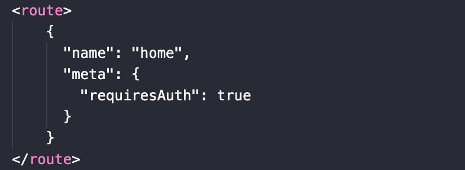
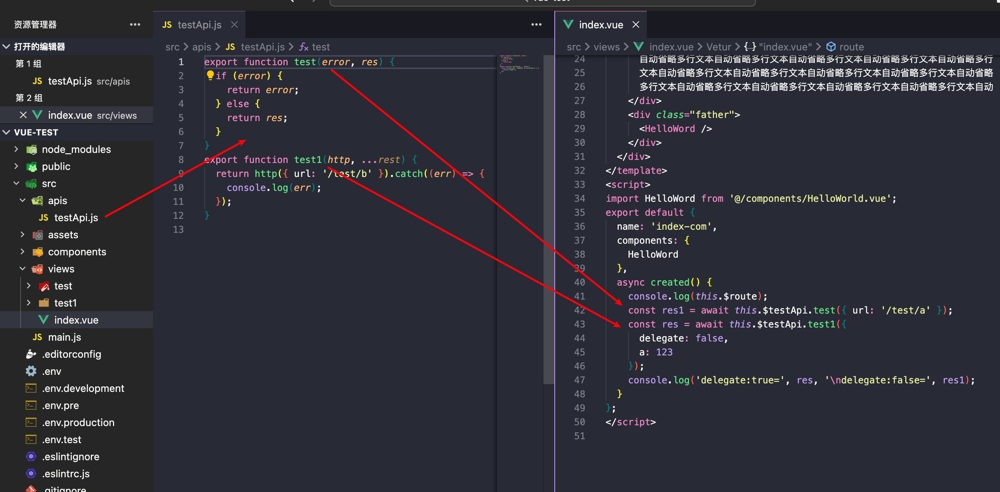
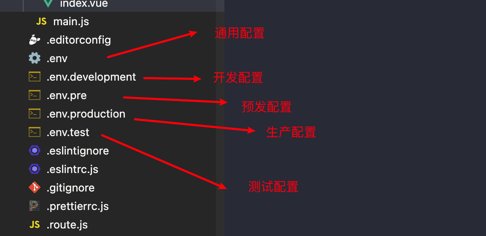

# 基于vue2的pc端项目模板
## 能力介绍
1.路由
  - 根据views目录结构自动生成路由表临时文件.route.js，生成规则和Nuxt框架一致
  
  - 路由meta信息配置可以在路由的对应.vue文件中添加route标签
  

2.API函数全局注入，自动挂载到vue全局,.vue文件中无需导入，直接从this.$文件名.函数名调用

3.环境变量配置

4.常用的开源包由@peter.fe/core统一导出
  
5.支持tailwindcss2.x  
6.支持ElementUI  
7.支持dayjs  
8.支持lodash  
## 目录介绍

├── .editorconfig  // ide相关配置
├── .env  // 通用环境变量配置文件
├── .env.development  // 开发环境变量配置文件
├── .env.pre  // 预发布环境变量配置文件
├── .env.production  // 生产环境变量配置文件
├── .env.test  // 测试环境变量配置文件
├── .eslintignore  // eslint忽略配置文件
├── .eslintrc.js  // eslint配置文件
├── .gitignore  // git忽略文件
├── .prettierrc.js  // prettierrc配置文件
├── README.md 
├── babel.config.js  // babel配置文件
├── jsconfig.json
├── package.json
├── postcss.config.js  // postcss配置文件
├── public
│   ├── favicon.ico
│   └── index.html  // html模板文件
├── src
│   ├── apis  // 服务端接口api目录
│   │   └── testApi.js
│   ├── assets  // 静态资源目录
│   │   ├── logo.png
│   │   └── style
│   │       └── tailwind.css
│   ├── components
│   │   ├── HelloWorld.vue
│   │   └── index-com.vue
│   ├── main.js  // 项目入口文件
│   └── views  // 路由生成目录
│       ├── index.vue
│       ├── test
│       │   └── index.vue
│       └── test1
│           └── _a.vue
├── tailwind.config.js  // tailwindcss配置
└── vue.config.js

